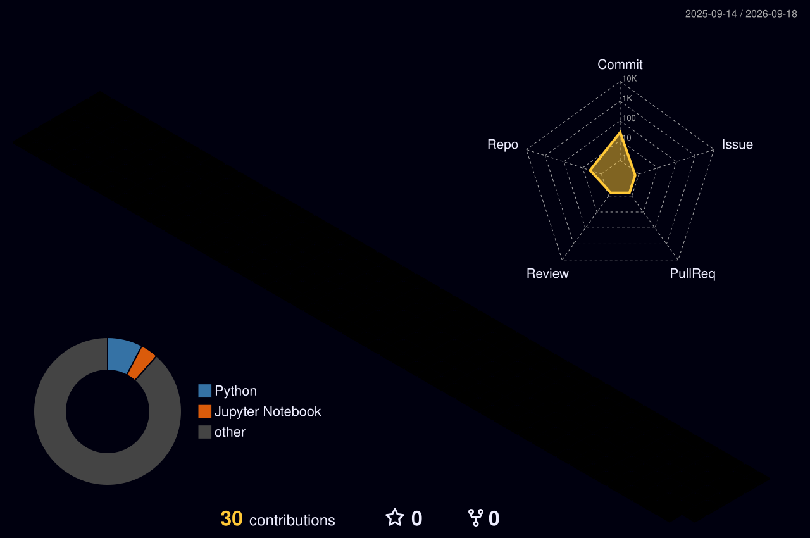

 

  

 

## 👋 About Me

I'm a third-year Computer Science and Engineering student at Lovely Professional University, focused on building toward a career in AI/ML engineering. I combine strong CS fundamentals — Data Structures, DBMS, Operating Systems, and Computer Networks — with hands-on work in Machine Learning, Deep Learning, NLP, and Generative AI.

I enjoy turning ideas into practical applications and learning by building, testing, and improving real projects.

 

## 🔭 Currently Building

- 🤖 AI-powered document intelligence applications
- 🧠 Practical Machine Learning projects
- 💬 NLP and Generative AI applications
- 🐍 Data-driven Python applications

## 📚 Currently Learning

- Advanced Machine Learning & Deep Learning
- Natural Language Processing
- Generative AI application architecture
- MLOps fundamentals

 

## 🛠️ Tech Stack

### 💻 Programming

### 🤖 AI / Machine Learning

### 🌐 Application Development

### 🗄️ Databases

### 🔧 Developer Tools

### 🧠 Core Computer Science

 

## 🚀 Featured Project

### 📚 AI Learning & Document Intelligence Platform

An AI-powered learning application that transforms PDF, DOCX, and TXT documents into interactive study material. Users can generate summaries, study notes, MCQs, keywords, and document analytics while asking questions directly against uploaded content.

**Tech:** Python · Streamlit · Google Gemini API · SQLite · PyMuPDF · python-docx · scikit-learn · KeyBERT

**Repository:** [View Project](https://github.com/Anshdeepsingh-ai/AI-LEARNING-DOCUMENT-INTELLIGENCE-PLATFORM)

 

## 📌 Other Projects

| Project | Description | Technologies |
|---|---|---|
| [Sentiment Analysis](https://github.com/Anshdeepsingh-ai/Sentiment-analysis) | NLP-based sentiment classification project. | Python · Machine Learning · NLP |
| [Pet Product Advisor](https://github.com/Anshdeepsingh-ai/pet-product-advisor-) | AI/ML-based application for pet product recommendations. | Python · ML/AI |
| [Plastic Footprints](https://github.com/Anshdeepsingh-ai/Plastic-Footprints) | Application focused on exploring plastic-footprint tracking. | Python |
| [Book Store](https://github.com/Anshdeepsingh-ai/Book-Store) | Book store application demonstrating application development concepts. | Python |

🧪 Smaller / Practice Projects

 

- [Python Code](https://github.com/Anshdeepsingh-ai/pythoncode)
- [Snake Water Gun Game](https://github.com/Anshdeepsingh-ai/snake-water-gun-game)

 

## 🎓 Training

**Campus to Corporate: Industry-Ready Data & AI Engineer Program**  
*June 2026 – July 2026*

Practical training covering SQL, Python, Machine Learning, and Artificial Intelligence with a focus on applying technical concepts to real-world data and AI problems.

 

## 🎓 Education

**Computer Science and Engineering**  
Lovely Professional University · 3rd Year

 

## 📜 Certifications

- **Programming using C++** — Infosys, August 2025
- **Intermediate English as a Second Language** — Saylor, July 2025
- **Data Management (Excel and Tableau)** — Tech Veda, March 2025
- **Web Development** — Rising Tech Pro

 

## 🏆 Achievements & Community

- **Rehras Sewa Society, Ludhiana** — Represented the society and collaborated with multiple NGOs to share insights, March 2026.
- **Award of Honor, Rehras Sewa Society** — Recognized for contribution toward the collection of 60 units of blood following an awareness camp, July 2025.

 

## 📊 GitHub Statistics

  

 

## 🐍 Contribution Activity

<picture>
  <source media="(prefers-color-scheme: dark)" srcset="https://raw.githubusercontent.com/Anshdeepsingh-ai/Anshdeepsingh-ai/output/github-contribution-grid-snake-dark.svg" />
  <source media="(prefers-color-scheme: light)" srcset="https://raw.githubusercontent.com/Anshdeepsingh-ai/Anshdeepsingh-ai/output/github-contribution-grid-snake.svg" />
  
</picture>

 

## 🏆 Contribution Skyline

 

## 📝 Recent Activity

<!--START_SECTION:activity-->
<!--END_SECTION:activity-->

 

## 🤝 Connect

 

